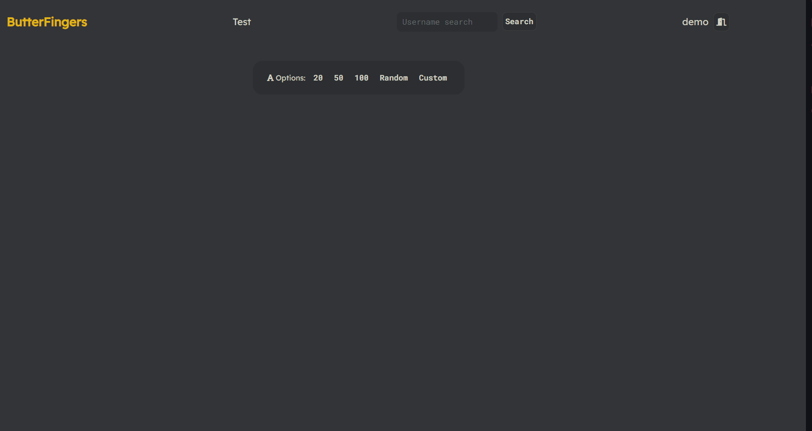
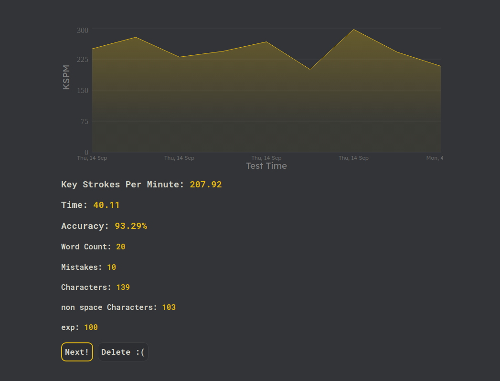
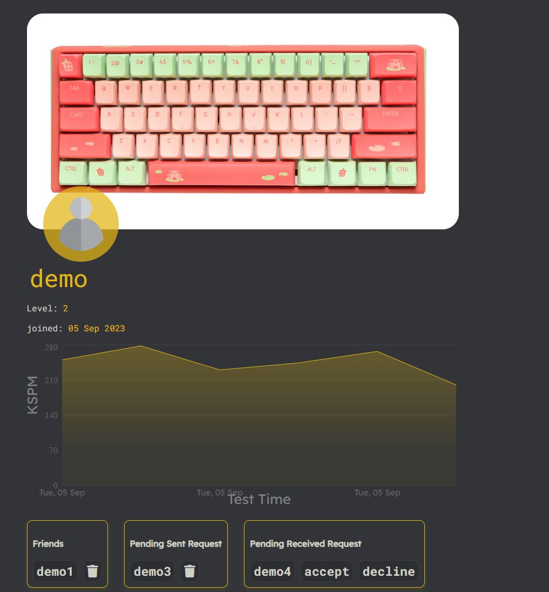
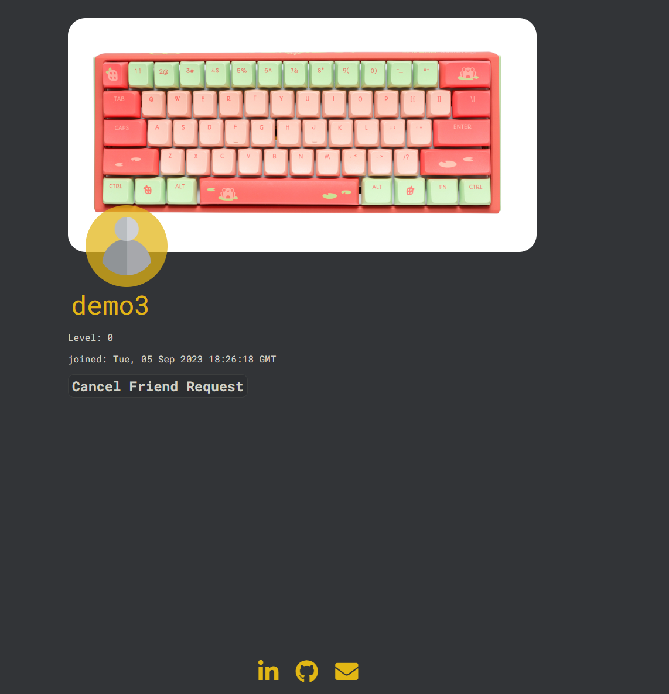

# ButterFingers

Engage in a dynamic typing game website that not only meticulously tracks your statistics but also offers the exciting feature of connecting with friends for added interactive enjoyment!


## Tech Stack

**Client:** React, Redux, CSS, Node

**Server:** Flask, SQLAlcemy, Alembic, postgreSQL


## Live Link

https://butterfingers.onrender.com/
## Demos

#### Typing Test


#### Results


#### User Profile


#### Non-Friend Profile

## Features

### Custom Texts
* Users can create a custom text to run
* Users can read/view and run other users texts
* Users can update their texts
* Users can delete their texts

### User Profiles
* Users can upload a profile picture
* Users can upload a cover picture
* Users can recieve and send friend request
* Users can view penning friend requests, either sent or recieving
* Users can view full profile of another user if they are friends
* Users can view part of other users profiles if the two users are not friends
* Users can delete friend connection
* Users can delete request or undo a decline

### Scores
* Create a score card, by running typing tests
* Read score card after completing a test
* Cancel the score card from being sumbitted
## Run Locally

Clone the project

```bash
    git clone https://github.com/CJThornburg/ButterFingers.git
```

Go to the project directory

```bash
    cd butterFingers
```

Install dependencies

```bash
    pipenv install -r requirements.txt
    pipenv run flask db init
    pipenv run flask db migrate
    pipenv run flask db upgrade
    pipenv run flask seed all

```

In seprate terminal
```bash
    cd react-app
    npm install
```


Start the servers


In root/ terminal
```bash
pipenv run flask run
```

In react-frontend/ terminal
```bash
    npm run start
```

## Environment Variables

To run this project locally, you will need to add the following environment variables to your .env file

`SECRET_KEY`

`DATABASE_URL`

`S3_BUCKET`

`S3_KEY`

`S3_SECRET`


## Color Reference

| Color             | Hex                                                                |
| ----------------- | ------------------------------------------------------------------ |
| Main |  #323437 |
| Secondary |  #f8f8f8 |
| Tertiary |  #E2B714 |


## Roadmap

- Site wide Highscores for featured texts will be displayed and searchable for your placement.

- Integrate More AWS capabilites
    - Update
    - Delete


## Connect

- [Linkdin](https://www.linkedin.com/in/chris-thornburg-swe/)

- [Email Me](mailto:cjthronburg@thornburgsfamily.com)
